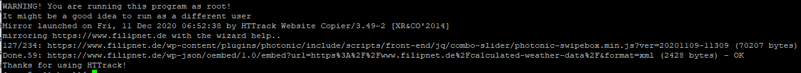

# optimize-images
Optimize and Compress JPEG or PNG Images in Linux command line

> **⚠ WARNING, IMPORTANT NOTICE BEFORE USE**  
> Before running any of this script, please make sure you have a valid backup, cause the script will replaces the original file, so you no longer have the original.

## FEATURES
You have a lot of images, and want to optimize and compress the images without losing its original quality?

This script solution can be used:
- before uploading them to any cloud storages or content management system 
- to optimize and compress images, that are already uploaded and active on a webserver

I use WordPress and love it, but the Image Optimization Plugins are not free, limited or buggy. If you have root access to your webserver, this script will help you to optimize the images. The following command line utilities to optimize images are used:

- jpegoptim – is a utility to optimize/compress JPEG files without loosing quality
- OptiPNG – is a small program that optimize PNG images to smaller size without losing any information

Please note that OptiPNG evaluates and processes the PNG image file individually on each call, and acts much slower here than is the case with JPG files.

## INSTALL PREREQUISITES
On Debian and it’s Derivatives
```
sudo apt-get install jpegoptim
sudo apt-get install optipng
```
On RedHat based Systems
```
yum install epel-release
yum install jpegoptim
yum install optipng
```

## INSTALL SCRIPT
```
cd /root; git clone https://github.com/filipnet/optimize-images.git
```

## SETUP OF A TEST ENVIRONMENT
It allows you to download a World Wide Web site from the Internet to a local directory, building recursively all directories, getting HTML, images, and other files from the server to your computer. HTTrack arranges the original site's relative link-structure. Simply open a page of the "mirrored" website in your browser, and you can browse the site from link to link, as if you were viewing it online. HTTrack can also update an existing mirrored site, and resume interrupted downloads. HTTrack is fully configurable, and has an integrated help system. (Source: https://www.httrack.com/)
```
# Install httrack
yum install httrack | apt install httrack
# Clone productive website to any working folder
httrack https://www.filipnet.de -O /var/www/html/
```


Afterwards you should see the HTTrack Index as followed after browsing your webserver


## USAGE
Optimization images newer 24 hours for cronjob batch processing (this is the default setting)
```
optimize-images.sh /path/to/image-directory/
```
Force optimization for all images inside given folder (for initial image optimization)
```
optimize-images.sh /path/to/image-directory/ -force
```

## WORDPRESS EXAMPLE
Determine the image directory size before image optimization:
```
du -s /var/www/html/www.filipnet.de/wp-content/uploads/
7276    /var/www/html/www.filipnet.de/wp-content/uploads/
```
Performing image optimization with the -force parameter to include all images:
```
.\optimize-images.sh /var/www/html/www.filipnet.de/wp-content/uploads -force 
```
Determine the image directory size after image optimization:
```
du -s /var/www/html/www.filipnet.de/wp-content/uploads/
5452    /var/www/html/www.filipnet.de/wp-content/uploads/
```
As you can see, the total size has been reduced from 7276 kb to 5452 kb, visually there are no noticeable changes to the image files in the browser.

``As a result, a total of 33.46% of storage space was saved in this test.``

## ADD TO CRONTAB
Add that to your crontab and you never have to think about it again.
```
$ crontab -l
@daily root /root/optimize-images/optimize-images.sh /path/to/image-directory/ >/dev/null 2>&1
```

## LICENSE
optimize-images and all individual scripts are under the BSD 3-Clause license unless explicitly noted otherwise. Please refer to the LICENSE
